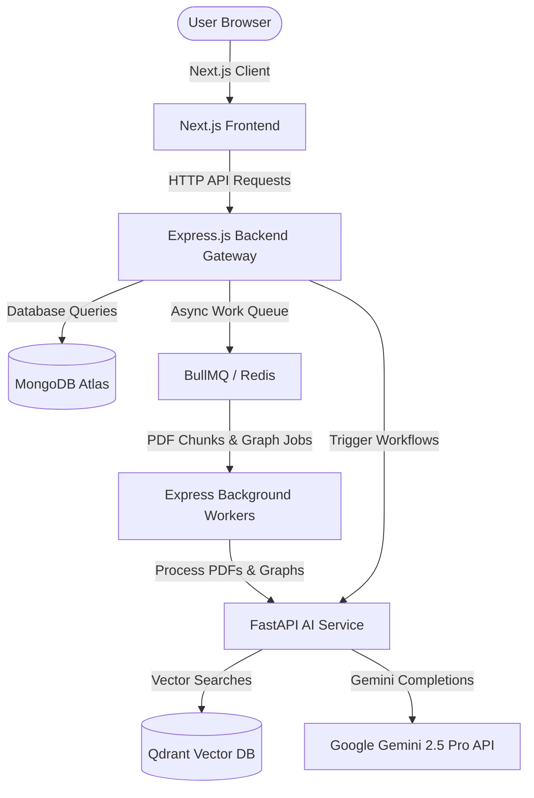
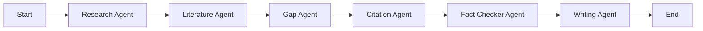

# ResearcherGPT: AI-Powered Academic Research Assistant & Multi-Agent Workspace

ResearcherGPT is an enterprise-grade academic research platform designed for PhD scholars, research labs, and universities. It automates the end-to-end scientific writing workflow—from ingestion of PDF papers to vector search, 3D concept mapping, multi-agent literature synthesis, citation compiles, claim validation, plagiarism detection, and Notion-style drafting.

---

## 🚀 High-Level Architecture & Tech Stack

The application is built using a **decoupled three-tier architecture** designed to scale independently under heavy load:



### 1. Frontend Client (React & Next.js 15)
* **Framework:** Next.js 15 (App Router, Client-side Rendering).
* **Styling & Animations:** Vanilla Tailwind CSS for UI controls, Framer Motion for interactive page states and tab transitions, and an interactive 3D particle constellation rendered dynamically on an HTML5 canvas.
* **State Management:** Zustand (for lightweight, reactive stores).
* **Rich Text Editing:** TipTap Editor (Notion-like canvas supporting inline LaTeX math parsing, tables, figures, and AI formatting).
* **Charts:** Recharts (for showing plagiarism metrics and ingestion history trends).

### 2. Backend Gateway (Node.js & Express & TypeScript)
* **Framework:** Express.js written in TypeScript.
* **Database:** MongoDB Atlas (via Mongoose ODM) to store relational states (projects, papers, citations, open gaps, agent runs, note drafts).
* **Task Queuing:** Redis & BullMQ. Handles asynchronous workflows like background PDF parsing, vector embedding triggers, and graph updates without blocking HTTP connections.

### 3. AI Service Engine (Python & FastAPI)
* **Framework:** FastAPI.
* **Agentic Workflows:** LangGraph (state machine for multi-agent workflows).
* **Vector Indexing:** Qdrant Vector Database. Stores semantic embeddings generated from paper text chunks.
* **Embedding Model:** `sentence-transformers` for dense vector indexing.
* **LLM Core:** Google Gemini 2.5 Pro / Flash APIs.
* **PDF Extractors:** PyMuPDF (`fitz`) and `pdfplumber` (for layout-aware table extraction).

---

## 🛠️ Step-by-Step Functional Workflow

### Step 1: PDF Ingestion & Ingestion Pipeline
1. The user uploads an academic PDF paper in the **Papers & Upload** tab.
2. The Express server receives the file, uploads it to storage, and pushes a task to the **BullMQ** queue.
3. The background worker pulls the task and sends the file to the **FastAPI AI Service**.
4. The AI Service uses `pdfplumber` and `PyMuPDF` to extract text, tables, and figures layout-sensitively.
5. The text is divided into chunks, converted into vector embeddings using `sentence-transformers`, and indexed in the **Qdrant** collection under the project's ID.

### Step 2: Multi-Agent LangGraph Pipeline (Synthesize)
When the user clicks "Synthesize", an autonomous LangGraph workflow is triggered:



* **Research Agent:** Queries Qdrant vectors to find paper content chunks relevant to the user's inquiry.
* **Literature Agent:** Synthesizes literature reviews. Extracts author, year, model details, metrics, datasets, and limitations from papers.
* **Gap Agent:** Mines limitations and constraints across synthesized papers to find unsolved open problems.
* **Citation Agent:** Automatically compiles reference style representations (APA, IEEE, Harvard, MLA) and generates bibliography lists.
* **Fact Checker Agent:** Sentence-splits generated text, detects claims, queries vector database for original evidence text, validates claim correctness, and calculates confidence ratings to prevent hallucinations.
* **Writing Agent:** Synthesizes the final publication-ready paper draft segmented into Abstract, Introduction, Literature Review, Methodology, Results, and References.

### Step 3: Interactive Features
* **3D Knowledge Graph:** Renders a 3D visualization showing connections between Authors, Papers, Methods, and Datasets.
* **Literature Review Matrix:** Displays a comparative matrix table showing the parsed attributes of uploaded papers (such as Datasets, Metrics, and Limitations).
* **Open Research Gaps Board:** Shows a board with AI-detected gap suggestions, enabling users to add, edit, and score ideas by Impact vs. Feasibility.
* **AI RAG Chat:** A custom chat window where users can ask questions about their paper library, getting verified source citations with exact page numbers.
* **Writing Workspace:** Notion-like TipTap canvas where the compiled manuscript can be edited, math equations rendered (via KaTeX), and exported to IEEE/ACM styled PDFs.
* **Plagiarism & AI Checker:** Checks for potential plagiarism, AI generation probability, perplexity, and burstiness indices.

---

## 🎓 Interview Q&A Prep Guide

### 1. **Q: How does the PDF Ingestion pipeline handle tables and equations?**
* **A:** We use a layout-aware PDF extraction strategy. Standard raw text extractors break tables and lose formula alignments. By utilizing `pdfplumber`, we extract coordinates of lines to reconstruct tables as standard markdown formatting. For mathematical expressions, we match standard LaTeX configurations (`$ ... $` and `$$ ... $$`) and map them, so they are saved correctly in the database and rendered cleanly via KaTeX on the frontend.

### 2. **Q: How does LangGraph maintain state across the multi-agent pipeline?**
* **A:** LangGraph utilizes a centralized `State` dictionary that is passed sequentially through nodes. Each agent (Node) takes the current state, processes its task (such as calling Gemini or querying Qdrant), updates specific fields in the state, and returns the modified state. Because the state is preserved, subsequent nodes (like the Fact Checker or Writer) can easily access the combined output of earlier stages (such as the extracted references, research gaps, and vector chunks).

### 3. **Q: Why did you use Redis and BullMQ on the backend?**
* **A:** PDF parsing, vector embedding generation, and multi-agent LangGraph orchestrations are long-running, blocking operations (often taking 15 to 90 seconds). Running these directly on the Express main thread would block the event loop and crash HTTP connections. By using **Redis** as a message broker and **BullMQ** as the queue system, we hand off these tasks to asynchronous background worker processes. The Express server immediately returns a `202 Accepted` response, and the client polls or listens to updates, ensuring a responsive and stable user experience.

### 4. **Q: How does the Fact-Checking Agent prevent AI hallucinations?**
* **A:** The Fact-Checking Agent works in three steps:
  1. It takes the drafted sections from the writing agent and uses NLP sentence tokenization to extract key statements and claims.
  2. For each claim, it converts the text to a query vector and performs a similarity search in **Qdrant** to retrieve original paper snippets.
  3. It passes the claim alongside the retrieved original snippets back to the LLM with a strict evaluation prompt. The model scores the claim alignment (Validated, Conflicting, or Unverified) and outputs the exact source snippet.

### 5. **Q: What is the benefit of the hybrid Lexical-Vector search in your RAG?**
* **A:** Vector search (using dense embeddings) is excellent at capturing semantic intent, but it fails to query specific keywords, product codes, or exact values (like finding "98.2% accuracy" or "ResNet-50"). By combining lexical search (keyword matching like BM25) and dense vector search, we retrieve highly context-rich and keyword-accurate text segments from the research papers.

---

## 💻 Local Setup & Execution

### Prerequisites
- Node.js v18+
- Python 3.10+
- Docker & Docker Compose
- Google Gemini API key

### Launching via Docker
1. Copy `.env.example` to `.env` in `client`, `server`, and `ai-service` folders and fill in your Gemini API keys.
2. In the root directory, run:
   ```bash
   docker-compose up --build
   ```
3. The frontend will be available at `http://localhost:3000` and the Express backend at `http://localhost:5000`.
