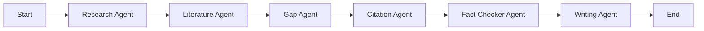

# Multi-Agent System Documentation

This document describes the design, prompts, and interfaces of the intelligent agents operating in ResearcherGPT.

## Orchestration Layer

The multi-agent workflow is orchestrated via **LangGraph**. A centralized state machine maintains state across execution steps, reporting logs, step progression, and outputs back to the Express gateway via HTTP callbacks.

## Agent Modules

### 1. Research Agent
* **Purpose:** Queries Qdrant vectors to find paper content chunks relevant to the user's inquiry.
* **Output:** Adds relevant paper text chunks to state context.

### 2. Literature Agent
* **Purpose:** Synthesizes literature reviews. Extracts author, year, model details, metrics, datasets, and limitations from papers.
* **Output:** Returns JSON list of literature review summaries.

### 3. Gap Agent
* **Purpose:** Mines limitations and constraints across synthesized papers to find unsolved open problems.
* **Output:** Returns JSON objects representing gaps with title, description, category, and impact scores.

### 4. Citation Agent
* **Purpose:** Automatically compiles reference style representations (APA, IEEE, Harvard, MLA) and generates bibliography lists.
* **Output:** Returns citation keys and styled bibliography strings.

### 5. Fact Checker Agent
* **Purpose:** Sentence-splits generated text, detects claims, queries vector database for original evidence text, validates claim correctness, and calculates confidence ratings.
* **Output:** Returns claims validation reports with scores (0.0 - 1.0).

### 6. Writing Agent
* **Purpose:** Synthesizes the final publication-ready paper draft segmented into Abstract, Introduction, Literature Review, Methodology, Results, and References.
* **Output:** Updates the database with the completed generated paper.
