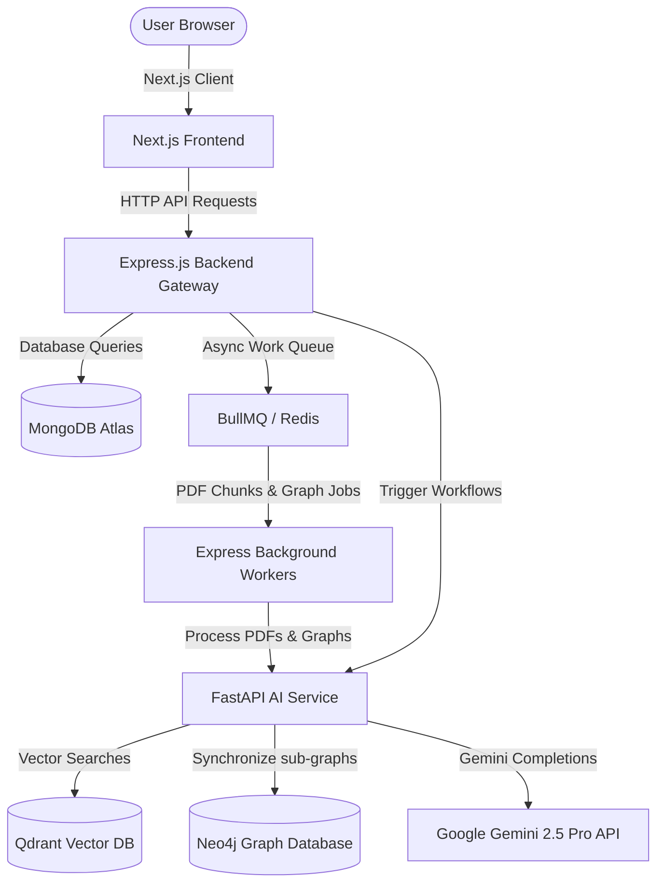

# ResearcherGPT System Architecture

This document outlines the architectural tiers, components, and data flows of the ResearcherGPT Enterprise AI Research Assistant platform.

## High-Level Tier Architecture

The platform is divided into three primary functional layers:

1. **Frontend Client (React/Next.js 15):** A modern, responsive user interface utilizing Zustand for state stores, Framer Motion for smooth transitions, and a rich, interactive workspaces dashboard.
2. **Backend Gateway (Node.js/Express/TypeScript):** Handles request routing, authentication, role-based access control (RBAC), and manages the MongoDB data storage layer (storing users, projects, papers, research gaps, claims, and generated papers).
3. **AI Intelligence Engine (FastAPI/Python):** Performs CPU/GPU-intensive tasks including PDF processing (via PyMuPDF and pdfplumber), vector indexing (via Qdrant), hybrid lexical-vector searches, sentence transformers re-ranking, and LangGraph workflow orchestration.

---

## Data Stores & Syncing Mechanisms

* **MongoDB:** Serves as the primary source of truth for structured application data.
* **Qdrant Vector Database:** Stores dense vector embeddings generated via `sentence-transformers` for semantic retrieval.
* **Neo4j Graph Database:** Synchronizes hierarchical graph structures of extracted scientific entities (authors, methods, datasets, metrics) and relationships.

## Authentication & RBAC

Authentication is secured through custom middleware. Users are mapped to roles:
* **Student:** Allowed to run searches and draft notes.
* **Researcher:** Default role. Full access to agent runs, manuscript compile tools, and citation managers.
* **Professor:** High clearance. Can generate peer review scoring sheets and critique manuscripts.
* **Admin:** Unrestricted clearance.
