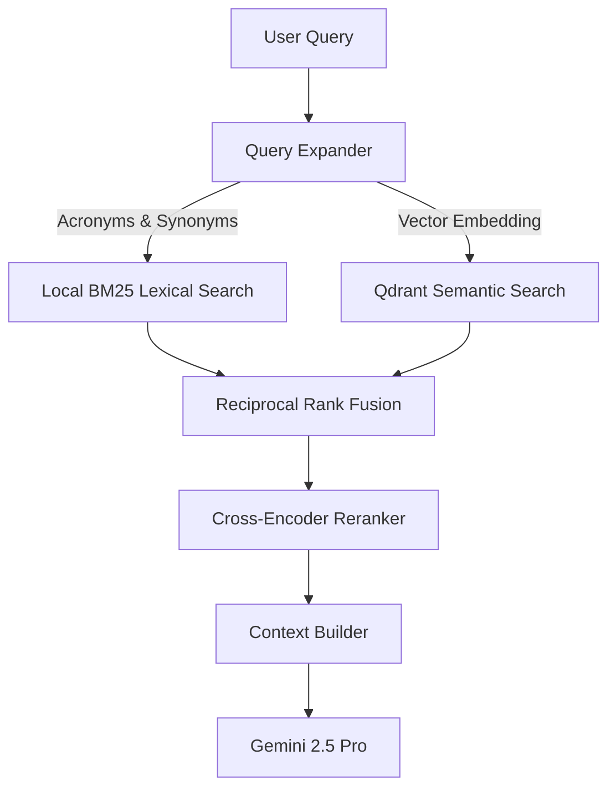

# Advanced Retrieval-Augmented Generation (RAG)

This document details the advanced retrieval pipeline implemented in the ResearcherGPT AI Engine.

## Processing Pipeline

## 1. Query Expansion
Queries are expanded to resolve vocabulary mismatch. Using the Gemini API or local thesaurus maps, terms are augmented with acronyms, alternative spelling, and domain synonyms.

## 2. Hybrid Search & Fusion
* **Lexical search:** In-memory TF-IDF/BM25 scores terms frequencies.
* **Vector search:** Cosine similarity calculation of dense embeddings generated by `sentence-transformers` against Qdrant records.
* **Reciprocal Rank Fusion (RRF):** Fuses the ranks of lexical and vector hits using the formula:
  \[
  RRF(d) = \sum_{m \in M} \frac{1}{k + r_m(d)}
  \]
  where \(k = 60\) and \(r_m(d)\) is the rank of document \(d\) in search method \(m\).

## 3. Cross-Encoder Re-ranking
Top candidate chunks are re-scored using the Cross-Encoder model (`cross-encoder/ms-marco-MiniLM-L-6-v2`). This yields highly accurate semantic relevance scores, filtering out irrelevant chunks before forwarding context to the LLM.

## 4. Context Builder
Aggregates relevant chunk blocks, author/note annotations, research gap summaries, and chat history into a structured prompt context formatted in markdown.
